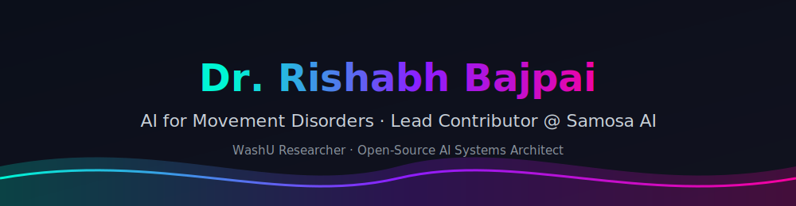

<!-- ======= DR. RISHABH BAJPAI · CYBERPUNK PROFILE ======= -->

  

  

  
  
  

---

## 🧬 Fast Facts & Bio

🏛️ **Academic Role:** Postdoctoral Research Associate at **Washington University in St. Louis (WashU)** — building machine learning & computer-vision frameworks for objective clinical diagnosis of pediatric movement disorders in cerebral palsy. See the **[Aravamuthan Lab team page](https://aravamuthanlab.wustl.edu/our-team/)**.

🚀 **Founder Role:** Founder of **Samosa AI** ([samosa-ai.com](https://samosa-ai.com)) — open-source, on-device, privacy-first AI tools for learning, productivity, and health.

🎯 **Mission:** Making advanced AI **accessible, transparent, and empowering** for everyone — across academia and industry.

🔗 **Links:** [🌐 Website](https://www.rishabh-bajpai.com/) · [📚 Google Scholar](https://scholar.google.com/citations?user=R87Z5zAAAAAJ&hl=en) · [💼 LinkedIn](https://www.linkedin.com/in/rishabh-bajpai) · [🧪 WashU Lab](https://aravamuthanlab.wustl.edu/our-team/) · [🤖 Samosa AI](https://github.com/samosa-ai-com)

---

## 🧠 Selected & Recent Academic Research and Publications

Machine-learning software tools for **objective clinical motor analysis** and **pediatric assessment**, validated in peer-reviewed clinical journals. (A selection below — full list on [Google Scholar](https://scholar.google.com/citations?user=R87Z5zAAAAAJ&hl=en).)

| Journal | Paper | Link |
| :--- | :--- | :--- |
| **Annals of Neurology** | Movement-disorder assessment framework | [📄 Read Paper](https://onlinelibrary.wiley.com/doi/10.1002/ana.78130) |
| **Scientific Reports (Nature)** | Pediatric motor analysis framework | [📄 Read Paper](https://www.nature.com/articles/s41598-026-50340-5) |

### 📈 Live Google Scholar Metrics

  
  
  
   
  

> ⚡ These counters update automatically every Sunday via the `google-scholar.yml` workflow (first run populates the numbers).

---

## 🤖 Samosa AI — Flagship Projects

<table>
  <tr>
    <td width="50%" align="center" valign="top">
      <h3>🎙️ Chanakya</h3>
      
Self-hostable local voice assistant with <b>1000+</b> MCP server integrations.

      
    </td>
    <td width="50%" align="center" valign="top">
      <h3>📚 Personal Guru</h3>
      
Personalized, adaptive AI learning companion with privacy-first study modes.

      
    </td>
  </tr>
  <tr>
    <td width="50%" align="center" valign="top">
      <h3>📱 Gotcha / Mobile OpenCode</h3>
      
Mobile-first, on-device AI agent controller for local full-stack development.

      
    </td>
    <td width="50%" align="center" valign="top">
      <h3>👁️ Watcher</h3>
      
Local CCTV AI processing server for all-day private, on-device video intelligence.

      
    </td>
  </tr>
</table>

> 🔗 Explore the full ecosystem at **[github.com/samosa-ai-com](https://github.com/samosa-ai-com)**.

---

## 🛠️ Tech Stack & Ecosystem

**Languages**

  
  
  
  
  
  

**AI / ML & Research**

  
  
  
  
  
  
  

**Backend & Infra**

  
  
  
  
  

**Platforms**

  
  
  
  

---

## ⚡ GitHub Analytics, Metrics & Citations

  

  

  

  

### 🌐 3D Contribution Graph

  

### 🏆 Achievements & 📅 Commit Calendar

  
  

### 👨‍💻 Lines of Code Changed & 📓 Active Repositories

  
  

  

> ⚡ The `metrics.yml` workflow (using your `METRICS_TOKEN`) regenerates these infographics daily. Images populate after the first Actions run.

---

## 🔗 Connect & Social

  
  
  
  
  
  

  

